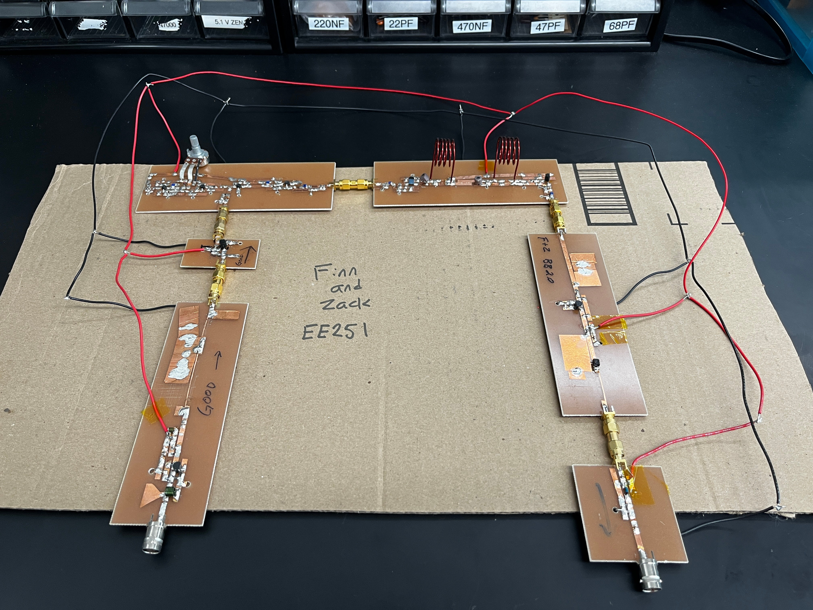
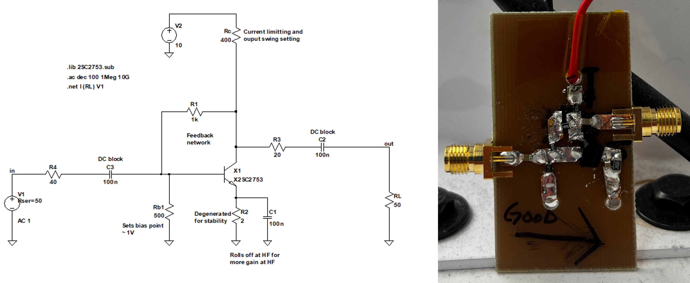
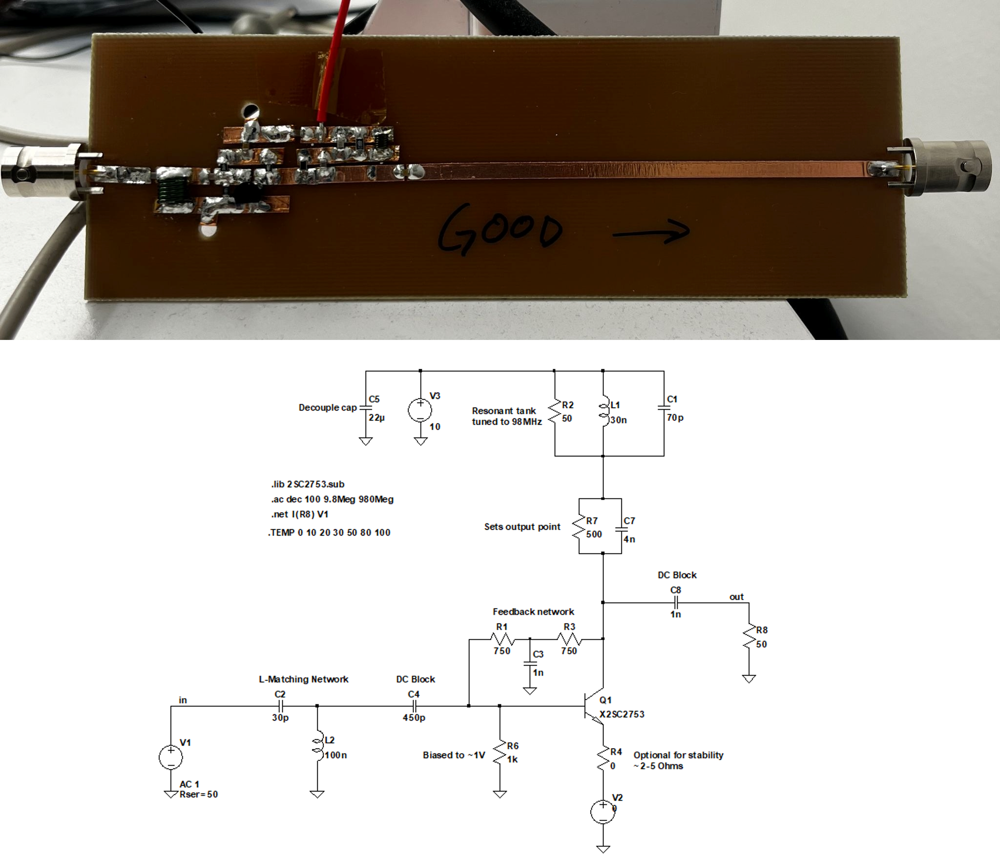
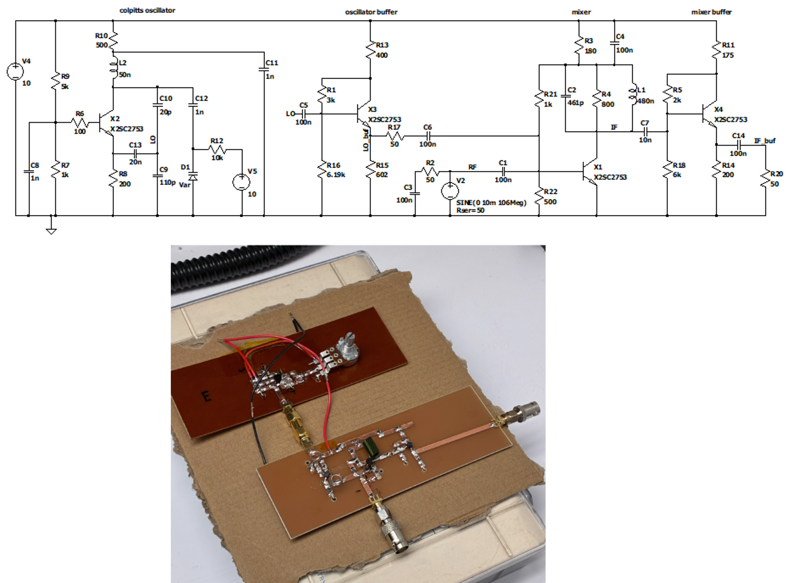
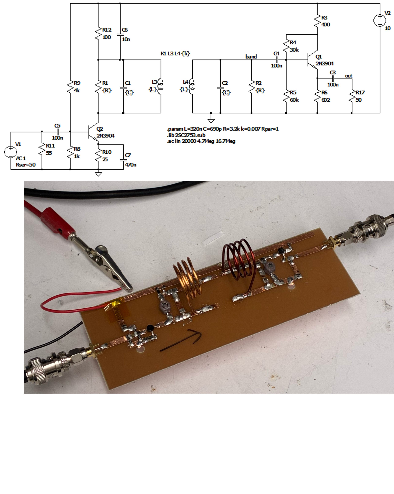

# Stanford EE 251 - High Frequency Circuit Design - FM Radio Final Project

This repo documents the completed labs in EE 251 that were used to make an FM radio receiver. The radio itself was made using FR4 boards, copper tape, discrete BJTS, and passive components like capacitors, resistors, and inductors. The circuit was simulated in blocks using LTSpice to validate our design before building and to help debug our boards after we built them. The first block of our radio (i.e. the front end) featured a cascaded broadband and narrowband amplifier. This was to boost the antenna signal and selectively amplify frequencies of interest. The second block was our mixer oscillator combo. This amplified signal are fed to a mixer, driven by a Colpitts oscillator, which mixed the signal down to an intermediate frequency. The final block was then an IF amplifier for selective filtering and gain, followed by a demodulation stage to extract the audio signal for the speaker. The image below is a photo of our fully assembled radio.

## First Block - Broadband and Narrowband Amplifier

The front end of our radio consists of a narrowband and broadband amplifier. The signal received off of the antenna is very small and needs to be gained up to do any signal processing and eventually hear a signal through a speaker. The broadband amplifier amplifies everything from DC to daylight and is used as a quick and easy way to get gain at the expense of gaining everything including the noise floor. The narrow band amplifier is used to selectively gain the frequencies of interest and attenuate everything else. The following discussions point out a few of the design choices made in making these amplifiers. For a more detailed discussion of the full design and our board’s performance please read the lab report which can be found in `lab2/`.

### Broadband Amplifier

The broadband amplifier used the common emitter topology with feedback. To help get a wide bandwidth the feedback is rolled off with a parallel capacitor which helps the amplifier have a flatter higher gain at higher frequencies. Below our schematic and an image of our assembled board.

### Narrowband Amplifier

The Narrowband amplifier uses an RLC tank circuit to selectively gain frequencies of interest. The RLC tank is tuned to resonate at the FM band with a quality factor low enough to roughly amplify the entire band. The parallel RC combo below the tank is to set the output operating point and is also set to roll off at higher frequencies. Below our schematic and an image of our assembled board.

## Second Block - Mixer and Colpitts Oscillator

The second block was our super heterodyne mixer and oscillator combo. The point of this block is to mix the frequencies of interest down to a lower frequency (11.7MHz). This is done to make downstream signal processing easier since it is a lower frequency, and it is now fixed. To generate our oscillations a Colpitts oscillator is used. Then by varying a varactor we can tune our Colpitts oscillator. We found it easier to design and build an oscillator for high side injection, so our oscillator operated from 98.7MHz to 118.7MHz. These signals were then mixed with the incoming RF from the amplifiers at the base of the mixer. The mixer itself was another common emitter amplifier with a resonant tank as a load. The resonant tank was tuned to operate at 11.7MHz. We also struggled with loading the oscillator once connected to the mixer which would kill our oscillations. To remedy this, we buffered the output of the oscillator and mixer to provide more robust isolations between these blocks and future blocks. Below is our schematic and image of our assembled boards. For a more detailed discussion of the full design and our board’s performance please read the lab report which can be found in `lab3/`.

## Third Block - IF Amplifier and Demodulation

The final block of our radio is an IF amplifier and a demodulation stage. The IF amplifier uses two coupled inductors to achieve a steep roll off over a narrow band. This was made by designing a coupled resonant tank with a quality factor higher than what was required, winding two inductors using thick wire to get a higher Q, and then spoiling the Q by adding series resistance to the inductor which gives the maximally flat response needed for the IF amplifier. The demodulation stage was just then a diode and capacitor pair used to extract the envelope off the amplified signal. Below is our schematic and image of our assembled boards. For a more detailed discussion of the full design and our boards performance please read the lab report which can be found in `lab4/`.

